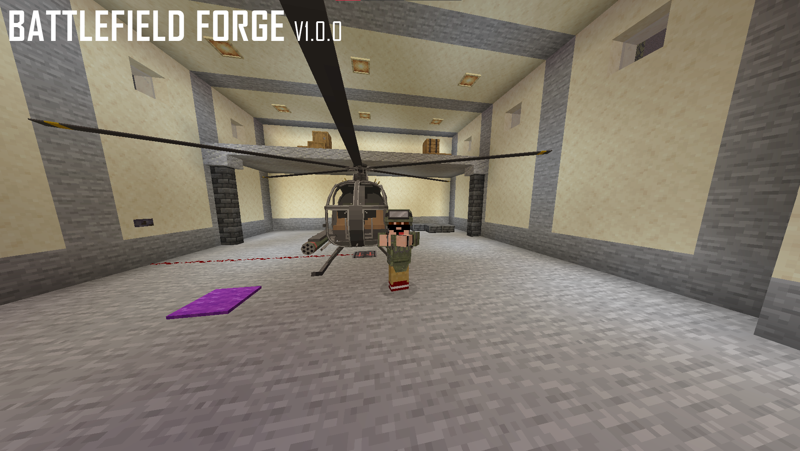
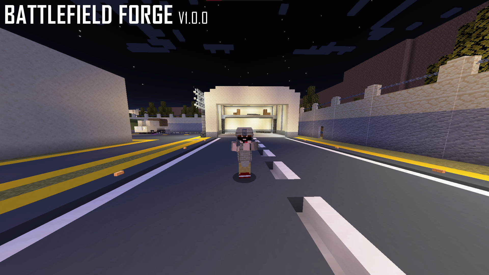

# Battlefield Forge (BF) Mod

---

## 🎬 Preview

  
*Battlefield Forge in action: Team combat & kit selection*

  
*Setting team-based spawn points using commands*

---

## 📖 About
**Battlefield Forge (BF)** is a team-based combat mod for **Minecraft Forge 1.20.1**.  

Players can:
- ⚔️ **Join teams**
- 📍 **Set team-based spawn points**
- 🛡️ **Battle with different kits**

Integrates with [SuperbWarfare](https://www.curseforge.com/minecraft/mc-mods/superbwarfare) for automatic weapon & armor kit assignment.

---

## 🛠 Key Features
- Team spawn points: `/ruspawn`, `/usaspawn`  
- Join teams: `/rujoin`, `/usajoin`  
- Custom kit system per team:
  - **RU Kit**: AK-47, AWM, MP-443, Russian armor set, health & ammo  
  - **USA Kit**: M4, AWM, Glock-17, US armor set, health & ammo  
- Fully compatible with **SuperbWarfare Mod**  
- Kits centrally managed in `Kits.java` → easy customization  

---

## 📦 Installation

**Step 1:** Install **Minecraft Forge 1.20.1**  
**Step 2:** Copy `bf-mod-x.x.x.jar`  
**Step 3:** Place it in `.minecraft/mods/`  
**Step 4:** Launch Minecraft with the Forge profile  

---

## 🎮 Commands

| Command      | Description                   | Admin Only |
|-------------|-------------------------------|------------|
| `/ruspawn`  | Set RU team spawn point       | ✅         |
| `/usaspawn` | Set USA team spawn point      | ✅         |
| `/rujoin`   | Join RU team                  | ❌         |
| `/usajoin`  | Join USA team                 | ❌         |

---

## 📌 Roadmap

 **Add support for more teams**

**Add class-based abilities to kits**

 **Implement in-game scoreboard & statistics**

 **Introduce team-based objectives (capture the flag, area defense)**

## 🤝 Requirements

**Minecraft Forge 1.20.1**

**SuperbWarfare Mod**

## 📝 License

**This project is licensed under the MIT License.**

